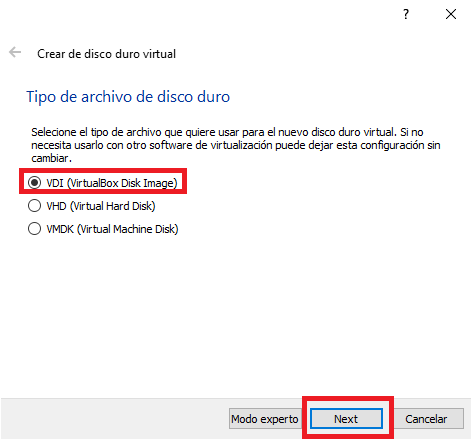

#  <b>Máquina Virtual </b>

<cite style="display:block; text-align: justify">Una máquina virtual es un software que crea una capa independiente donde se emula el funcionamiento de un ordenador real con todos los componentes de hardware que necesita para funcionar (disco duro, memoria RAM, tarjetas de red, tarjeta gráfica, etc.) y que puede ejecutar cualquier sistema operativo o programa, tal y como lo haría un ordenador real. Toda esta emulación se encapsula en una serie de archivos que actúan como contendor desde el que se ejecuta la máquina virtual en una ventana de tu ordenador como si de un programa más se tratara y sin que nada de lo que suceda en el interior de esa ventana afecte al ordenador que la ejecuta.</cite>

 

#  <b>Creación de Máquina Virtual </b>

<cite style="display:block; text-align: justify">Para este caso vamos a instalar [Ubuntu 21.10][1_1], esta instalación la vamos a realizar dentro de un programa llamado [VirtualBox][1_0], este programa nos permitirá correr el sistema de Ubuntu dentro de nuestra computadora sin tener que hacer modificaciones fisicas.</cite>

[1_0]:https://www.virtualbox.org/wiki/Downloads

[1_1]:https://ubuntu.com

<cite style="display:block; text-align: justify">Abrimos el VirtualBox y le damos el nueva para crear una nueva máquina virtual.</cite>

<cite style="display:block; text-align: justify">Le damos un nombre a nuestra máquina virtual, en nuestro caso la llamaremos Ubuntu 21.10 ya que ese es el Sistema Operativo con el que vamos a trabajar.</cite>

<cite style="display:block; text-align: justify">En la parte donde dice carpeta de máquina, es la ubicación donde se va almacenar nuestra maquina virtual, la podemos dejar como esta por defecto, pero en nuestro caso la vamos a almacenar en un disco externo.

Para eso le daremos en otro y buscaremos nuestro disco externo, una vez encontrado seleccionamos la carpeta y le damos en siguiente.
</cite>

#  <b>Tamaño de la memoria RAM</b>

<cite style="display:block; text-align: justify">En esta ventana nos pide que le asignemos la cantidad de memoria Ram con la que queremos crear nuestra maquina, para nuestro caso le vamos a asignar 4G (4000 MB).

Debemos tener en cuenta que la cantidad de memoria asignada debe estar dentro de la parte de color verde ya que si nos pasamos a la parte de color rojo puede que nuestra máquina se ponga lenta.

Una vez asignada la memoria Ram le damos en siguiente.
</cite>

# <b>Disco duro</b>

<cite style="display:block; text-align: justify">Necesitaremos un disco duro para nuestra maquina Virtual, teniendo en cuenta esto dejaremos seleccionada la opción de crear un [disco duro virtual][1_2].
</cite>

[1_2]:https://es.wikipedia.org/wiki/Disco_virtual

# <b>Tipos de archivo de disco duro virtual en VirtualBox</b>

<cite style="display:block; text-align: justify">En esta ventana nos pide que seleccionemos el tipo de archivo que queremos usar para nuestro disco duro virtual.

Nos muestran 3 opciones las cuales son:
* <b>VDI (VirtualBox Disk Image):</b> Es la selección por defecto, es el sistema utilizado por Oracle VM VirtualBox, por lo que si no buscamos nada extravagante será la opción a elegir.

* <b>VHD (Virtual Hard Disk):</b> Es la opción a elegir si lo que queremos es crear un disco virtual versátil, que podamos recuperar cualquier archivo en su interior fácilmente. Se podrá utilizar como unidad de almacenamiento habitual y soporta particiones de todo tipo, como cualquier otro disco duro, además de varios usuarios por cada SO virtual instalado en él. Se utiliza sobre todo para Microsoft Virtual PC.

* <b> VMDK (VirtualBox Machine Disk):</b> Es el formato típico de VMWare (otro software de virtualización, semejante a VirtualBox). Se escogerá esta opción para contar con plena compatibilidad entre VMWare y VirtualBox y poder pasar sistemas operativos virtuales entre ambos softwares sin mayor problema.

Nosotros lo dejaremos en la opción de <b>VDI</b> y le daremos siguiente.
</cite>

