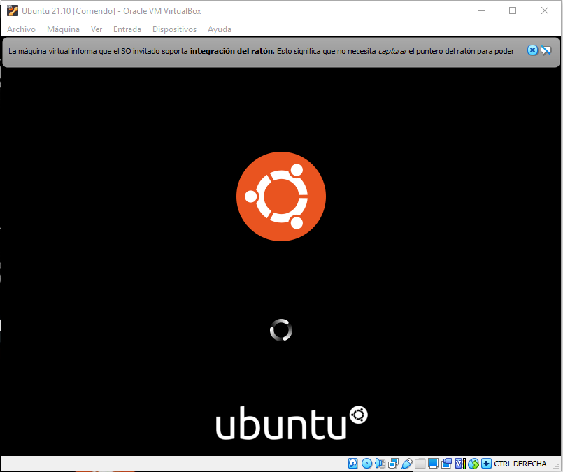
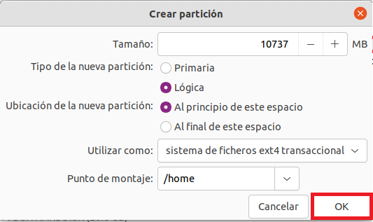

# <b>Ubuntu 21.10</b>

<cite style="display:block; text-align: justify">[Ubuntu 21.10][1_0] es una [distribución de GNU/Linux][1_1] basada en [Debian][1_2], que incluye principalmente software libre y de código abierto.

Puede utilizarse en ordenadores y servidores. Está orientado al usuario promedio, con un fuerte enfoque en la facilidad de uso y en mejorar la experiencia del usuario. 

Está compuesto de múltiple software normalmente distribuido bajo una licencia libre o de código abierto.</cite>

[1_0]:https://es.wikipedia.org/wiki/Ubuntu

[1_1]:https://es.wikipedia.org/wiki/Distribución_Linux

[1_2]:https://es.wikipedia.org/wiki/Debian_GNU/Linux

[1_3]:https://sites.google.com/site/alternativalinux/particiones-en-linux

 

# <b>Procedimiento de instalación de Ubuntu 21.10</b>

<cite style="display:block; text-align: justify">Una vez terminemos con la creación y configuración de nuestra maquina virtual, lo que prosigue es iniciar la Maquina virtual y terminar con la istalación.</cite>

 

# <b>Paso 1 - Arranque inicial </b>

<cite style="display:block; text-align: justify">Arranque inicial desde la Máquina Virtual en VirtualBox con la ISO de Ubuntu.

Al principio la pantalla aparecera muy pequeña pero una vez termine la instalación configuraremos la resolución de la pantalla.</cite>

 

 

# <b>Paso 2 - Idioma </b>

<cite style="display:block; text-align: justify">Configuración del Idioma del proceso de Instalación, en nuestro caso lo instalaremos con el idioma Español y le damos en instalar</cite>

# <b>Paso 3 - Mapa de caracteres</b>

<cite style="display:block; text-align: justify">Configuración del Mapa de caracteres (Idioma) del Teclado, en nuestro caso seleccionaremos Español latinoamericano y le daremos en continuar.</cite>

# <b>Paso 4 - Actualizaciones y otro Software</b>

<cite style="display:block; text-align: justify">En esta ventana nos muestra dos opciones las cuelas son:

* <b>Instalación Normal: </b> La cual incluye una colección de paquetes y programas seleccionados por Canonical para ofrecer la mejor experiencia posible a los usuarios.

* <b>Instalación Minima: </b>Este nuevo modo nos permitirá instalar en nuestro sistema una versión minimalista de Ubuntu, instalando exclusivamente los paquetes que se consideran esenciales para la distro, como el escritorio, un navegador web (Firefox) y poco más. De esta manera, en vez de llenar nuestro disco de aplicaciones innecesarias, podremos partir de una versión limpia la cual podemos ir personalizando a medida que la vayamos utilizando.

en nuestro caso trabajaremos con la instalación normal y le daremos en continuar.
</cite>

# <b>Paso 5 - Tipo de instalación</b>

<b>[Tipos de particiones y sistemas de archivos][1_3]</b>

<cite style="display:block; text-align: justify">Particionar un disco duro es realizar una división en él de modo que, a efectos prácticos, el sistema operativo crea que tienes varios discos duros, cuando en realidad sólo hay un único disco físico dividido en varias partes. De este modo, se pueden modificar o borrar particiones sin afectar a los demás datos del disco.

Las particiones básicas se llaman <b>primarias</b> y puede haber a lo sumo 4. Esto puede ser suficiente para nuestros intereses. Como a veces no es así, se crearon las particiones extendidas que pueden albergar otras particiones dentro, llamadas <b>lógicas.</b>

Los sistemas de archivos indican el modo en que se gestionan los archivos dentro de las particiones. Según su complejidad tienen características como previsión de apagones, posibilidad de recuperar datos, indexación para búsquedas rápidas, reducción de la fragmentación para agilizar la lectura de los datos, etc. Hay varios tipos, normalmente ligados a sistemas operativos concretos. 

A continuación se listan los más representativos:

* <b> fat32 o vfat:</b> Es el sistema de archivos tradicional de MS-DOS y las primeras versiones de Windows. Por esta razón, es considerado como un sistema universal, aunque padece de una gran fragmentación y es un poco inestable.

* <b> ntfs:</b> Es el nuevo sistema de Windows, usado a partir del 2000 y el XP. Es muy estable. El problema es que es privativo, con lo cual otros sistemas operativos no pueden acceder a él de manera transparente. Desde Linux sólo se recomienda la lectura, siendo la escritura en estas particiones un poco arriesgada.

* <b> ext2:</b> Hasta hace poco era el sistema estándar de Linux. Tiene una fragmentación bajísima, aunque es un poco lento manejando archivos de gran tamaño.

* <b> ext3:</b> Es la versión mejorada de ext2, con previsión de pérdida de datos por fallos del disco o apagones. En contraprestación, es totalmente imposible recuperar datos borrados. Es compatible con el sistema de archivos ext2. Actualmente es el más difundido dentro de la comunidad GNU/Linux y considerado el estándar de facto.

* <b> ext4:</b> Es un sistema de archivos con registro por diario (en inglés Journaling), anunciado el 10 de octubre de 2006, como una mejora compatible de ext3. La principal novedad en Ext4 es Extent, o la capacidad de reservar un área contigua para un archivo; esto puede reducir y hasta eliminar completamente la fragmentación de archivos. Es el sistema de archivos por defecto desde Ubuntu Jaunty.

* <b> ReiserFS:</b> Es el sistema de archivos de última generación para Linux. Organiza los archivos de tal modo que se agilizan mucho las operaciones con éstos. El problema de ser tan actual es que muchas herramientas (por ejemplo, para recuperar datos) no lo soportan.

* <b> swap:</b> Es el sistema de archivos para la partición de intercambio de Linux. Todos los sistemas Linux necesitan una partición de este tipo para cargar los programas y no saturar la memoria RAM cuando se excede su capacidad. En Windows, esto se hace con el archivo pagefile.sys en la misma partición de trabajo, con los problemas que conlleva.
</cite>

<b>Tamaño de las particiones</b>

<cite style="display:block; text-align: justify">Tenemos un disco duro con mucho espacio pero no sabemos cómo administrarlo. Puesto que a cada partición se le va a dar un uso diferente, cada una tendrá un tamaño diferente.

* Para empezar, necesitamos la partición para la memoria de intercambio, que será de tipo <b>swap.</b> Es una costumbre extendida que ésta sea del doble de tamaño que la memoria RAM disponible.

* La partición donde instalaremos Ubuntu <b>(/)</b> debe tener al menos 2 GB. Si pretendemos instalar más programas es recomendable darle un poco más de espacio. Para un uso normal, unos 7 u 8 GB estarán bien.

* Finalmente, es recomendable guardar los archivos personales (documentos, imágenes, películas, etc.) en una partición aparte. Así, si en algún momento quiere reinstalar Ubuntu desde cero, podrá formatear sin miedo y sin perder la configuración de sus programas. Esta partición suele montarse en <b>/home.</b> Su tamaño depende principalmente de cuántos usuarios usen el sistema y del volumen de datos que almacenen.
</cite>

<cite style="display:block; text-align: justify">Teniendo en cuenta lo explicado anteriormente, vamos a proseguir con nuestra instalación.

Le quitaremos la opcion Borrar disco por que no tenemos nada instalado, y le daremos en mas opciones ya que en esta parte podremos configurar y crear las particiones.

Le damos en continuar. </cite>

<cite style="display:block; text-align: justify">Nos ubicaremos en el disco en el cual queremos crear una nueva tabla de particiones para realizar las configuraciones correspondientes, en este caso vamos a añadir en nuestro disco principal la memoria de intercambio y el root.</cite>

<cite style="display:block; text-align: justify">Nos aparecera esta ventana donde nos pregunta si deseamos crear una nueva tabla de particiones en la cual le daremos continuar.</cite>

<cite style="display:block; text-align: justify">Nos muestra el espacio libre que tenemos para asignar nuestras particiones, en nuestro caso tenemos 26843 MB de espacio libre.

Le daremos en el signos "+" para agregar una nueva particion.</cite>

<cite style="display:block; text-align: justify">

* En nuestra primera partición le daremos un tamaño de 8000 MB, ya que esta será para la memoria de intercambio.

* La dejamos en nueva partición primaria, ya que este no se podrá borrar.

* En utilizar como lo dejaremos en área de intercambio, esto nos permitirá guardar los archivos de intercambio.

Le damos en aceptar y se nos creara nuestra primera partición.
</cite>

<cite style="display:block; text-align: justify">Aqui ya podemos ver que nuestra primera particion se ha creado correctamente.
</cite>

<cite style="display:block; text-align: justify">La segunda partición que crearemos sera la del Root con el espacio que nos queda disponible en el disco, en nuestro caso nos queda 18MB, seleccionamos el espacio libre y realizaremos el mismo proceso anterior.
</cite>

<cite style="display:block; text-align: justify">

* Le daremos un tamaño de 10 GB (10000 MB).

* Tipo de memoria primaria ya que esta será la memoria extra.

* Ubicación de la partición al principio de este espacio.

* Utilizar como ext4, el cual ya explicamos anteriormente.

* Punto de montaje (/).

Le daremos en aceptar y así se creara nuestra segunda partición.

</cite>

<cite style="display:block; text-align: justify">Asi nos quedarian nuestra dos particiones creadas en el disco <b>/dev/sda</b>
</cite>

<cite style="display:block; text-align: justify">Acontinuación vamos a crear una nueva tabla de particiones pero esta vez en el disco <b>/dev/sdb</b>, ya que en este disco vamos a crear el /Home.

Repetimos los pasos anteriores para crear la nueva tabla de particiones y una particion nueva.

* Vamos a asignarle todo el espacio que tengamos disponible, en nuestro caso son 10GB.

* El tipo de la partición la dejaremos en lógico, ya que esta funciona como si fuera un dispositivo independiente, y puede ser utilizada para almacenar cualquier archivo.

* La utilizaremos como ext4.

* El punto de montaje será /Home

Le daremos aceptar y ya estará nuestra partición creada.

</cite>

<cite style="display:block; text-align: justify">Una vez configuradas nuestras particiones podemos elegir en donde queremos instalar nuestra ISO, ya que anteriormente habiamos creado dos discos uno de 26GB y el otro de 10GB, vamos a escoger el de 26GB para instalar nuestro Sistema Operativo.

Lo seleccionamos y le damos en instalar ahora.</cite>

<cite style="display:block; text-align: justify">En esta ventana le daremos continuar.</cite>

# <b>Paso 6 - ¿Donde se Encuentra?</b>

<cite style="display:block; text-align: justify">Configuraciones relacionadas con la región geográfica de la instalación, con esta configuracion arreglamos la fecha y la hora de nuestro sistema operativo.</cite>

# <b>Paso 7 - Configuración de usuario</b>

<cite style="display:block; text-align: justify">Configuraciones relacionadas con los usuarios del Sistema Operativo.

Llenamos los datos que nos solicita, elejimos una contraseña y en nuestro caso seleccionaremos la opción de iniciar sesión automáticamente.

Una vez configurado eso, le daremos en continuar.</cite>

# <b>Paso 8 - Inicio del proceso de instalación de Ubuntu</b>

<cite style="display:block; text-align: justify">Copiado de archivos de la ISO al disco duro.</cite>

<cite style="display:block; text-align: justify">Procesamiento de los archivos copiados al disco duro.</cite>

<cite style="display:block; text-align: justify">Procesos y configuraciones varias para finalizar la configuración inicial de la Distribución instalada.</cite>

# <b>Paso 9 - Reinicio</b>

<cite style="display:block; text-align: justify">Primer reinicio del Sistema Operativo instalado.

Una vez terminada la instalación del sistema operativo nos va a pedir que reiniciemos el sistema.</cite>

<cite style="display:block; text-align: justify">Inicio del gestor de Ubuntu.</cite>

# <b>Paso 10 - Pasos finales de la Instalación y configuración inicial de Ubuntu 21.10</b>

<cite style="display:block; text-align: justify">Configurar cuentas en líneas del usuario creado, en nuestro caso le daremos omitir.</cite>

<cite style="display:block; text-align: justify">Configuración de retroalimentación con Ubuntu 21.10, en nuestro caso seleccionaremos la opción de no enviar información y le daremos en siguiente.</cite>

<cite style="display:block; text-align: justify">Configuración de opciones de privacidad del usuario generado.</cite>

<cite style="display:block; text-align: justify">Aviso de finalización de instalación y configuración inicial.</cite>

# <b>Paso 11 - Resolución de pantalla</b>

<cite style="display:block; text-align: justify">Para cambiar la resolución de nueustra pantalla lo que haremos sera darle clic derecho al escritorio y seleccionamos la opción que dice <b>Preferencias de pantalla</b></cite>

<cite style="display:block; text-align: justify">En esta ventana nos vamos a la parte que dice resolución y escogemos la resolucion que le queremos dar a nuestra pantalla, en nuestro caso vamos a escoger la de 1920 x 1080 y le damos en aplicar.</b></cite>

<cite style="display:block; text-align: justify">De esta manera nuestra pantalla se vera mucho mejor.</b></cite>

