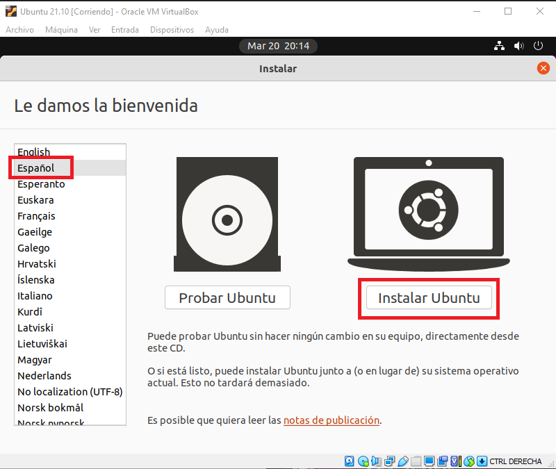

# <b>Ubuntu 21.10</b>

<cite style="display:block; text-align: justify">[Ubuntu 21.10][1_0] es una [distribución de GNU/Linux][1_1] basada en [Debian][1_2], que incluye principalmente software libre y de código abierto.

Puede utilizarse en ordenadores y servidores. Está orientado al usuario promedio, con un fuerte enfoque en la facilidad de uso y en mejorar la experiencia del usuario. 

Está compuesto de múltiple software normalmente distribuido bajo una licencia libre o de código abierto.</cite>

[1_0]:https://es.wikipedia.org/wiki/Ubuntu

[1_1]:https://es.wikipedia.org/wiki/Distribución_Linux

[1_2]:https://es.wikipedia.org/wiki/Debian_GNU/Linux

 

# <b>Procedimiento de instalación de Ubuntu 21.10</b>

<cite style="display:block; text-align: justify">Una vez terminemos con la creación y configuración de nuestra maquina virtual, lo que prosigue es iniciar la Maquina virtual y terminar con la istalación.</cite>

 

# <b>Paso 1 - Arranque inicial </b>

<cite style="display:block; text-align: justify">Arranque inicial desde la Máquina Virtual en VirtualBox con la ISO de Ubuntu.

Al principio la pantalla aparecera muy pequeña pero una vez termine la instalación configuraremos la resolución de la pantalla.</cite>

 

 

# <b>Paso 2 - Idioma </b>

<cite style="display:block; text-align: justify">Configuración del Idioma del proceso de Instalación, en nuestro caso lo instalaremos con el idioma Español y le damos en instalar</cite>

# <b>Paso 3 - Mapa de caracteres</b>

<cite style="display:block; text-align: justify">Configuración del Mapa de caracteres (Idioma) del Teclado, en nuestro caso seleccionaremos Español latinoamericano y le daremos en continuar.</cite>

# <b>Paso 4 - Actualizaciones y otro Software</b>

<cite style="display:block; text-align: justify">En esta ventana nos muestra dos opciones las cuelas son:

* <b>Instalación Normal: </b> La cual incluye una colección de paquetes y programas seleccionados por Canonical para ofrecer la mejor experiencia posible a los usuarios.

* <b>Instalación Minima: </b>Este nuevo modo nos permitirá instalar en nuestro sistema una versión minimalista de Ubuntu, instalando exclusivamente los paquetes que se consideran esenciales para la distro, como el escritorio, un navegador web (Firefox) y poco más. De esta manera, en vez de llenar nuestro disco de aplicaciones innecesarias, podremos partir de una versión limpia la cual podemos ir personalizando a medida que la vayamos utilizando.

en nuestro caso trabajaremos con la instalación normal y le daremos en continuar.
</cite>

# <b>Paso 5 - Tipo de instalación</b>
