# <b> Comandos más usados en sistemas Linux </b>

<cite style="display:block; text-align: justify">Aunque muchas distribuciones de Linux incorporan modernos y avanzados GUI o interfaces gráficos, el máximo potencial de este sistema operativo se consigue tecleando comandos en la consola.

Es necesario conocer una serie de comandos Linux básicos para poder operar en este sistema operativo de forma más rápida y eficiente.

Desde la consola podemos ejecutar todo tipo de comandos y archivos, desde los más sencillos, a los más avanzados. Eso sí, esta terminal se suele utilizar para ejecutar todo aquello a lo que no tenemos acceso desde la interfaz gráfica del sistema operativo. </cite>

# Comandos para la administración de archivos en Linux

# 1. cd

<cite style="display:block; text-align: justify">Cd (de change directory o cambiar directorio), es como su nombre lo indica el comando que necesitarás para acceder a una ruta distinta de la que te encuentras. 

Por ejemplo, si estas en el directorio /home y deseas acceder a /home/ejercicios, seria:

    $ cd /home/ejercicios

Si estás en /home/ejercicios y deseas subir un nivel (es decir ir al directorio /home), ejecutas:

    $ cd …

</cite>

# 2. pwd

<cite style="display:block; text-align: justify">Pwd (de print working directory o imprimir directorio de trabajo), es un conveniente comando que imprime nuestra ruta o ubicación al momento de ejecutarlo, así evitamos perdernos si estamos trabajando con múltiples directorios y carpetas. Su sintaxis seria:

    $ pwd

</cite>

# 3. ls

<cite style="display:block; text-align: justify">Ls (de listar), permite listar el contenido de un directorio o fichero. La sintaxis es:

    $ ls /home/directorio

El comando ls tiene varias opciones que permiten organizar la salida, lo que resulta particularmente útil cuando es muy grande. Por ejemplo, puedes usar -a para mostrar los archivos ocultos y -l para mostrar los usuarios, permisos y la fecha de los archivos. Así como para todos los comandos Linux, estas opciones pueden combinarse, terminando en algo como:

    $ ls -la /home/directorio

</cite>

# 4. rmdir

<cite style="display:block; text-align: justify">Elimina los directorios sólo si están vacíos. Su sintaxis es la siguiente:

    rmdir [-p][-v][--ignore-fail-on-non-empty][--help][--version] directorio [directorio ...]

Expliquemos un poco las opciones:

* -p: Si el directorio a borrar incluye más de un directorio en el camino, lo borra, luego quita el último componente y borra el directorio resultante, así hasta que todos los componentes hayan sido eliminados. Así, rmdir -p a/b/c es equivalente a rmdir a/b/c; rmdir a/b; rmdir a.

* -v, – -verbose: Muestra un mensaje por cada directorio procesado.

* -ignore-fail-on-non-empty: rmdir no borrará un directorio que no está vacío. Esta opción hace que rmdir ignore el fallo para eliminar el directorio, si ese fallo se debe a que el directorio no está vacío.

* -help: Muestra la ayuda y finaliza.

* -version: Informa de la versión y finaliza.
</cite>

# 5. touch

<cite style="display:block; text-align: justify">Touch crea un archivo vacío, si el archivo existe actualiza la hora de modificación. 

Para crear el archivo prueba1.txt en /home, seria:

    $ touch /home/prueba1.txt

</cite>

# 6. rm

<cite style="display:block; text-align: justify">Rm (de remove o remover), es el comando necesario para borrar un archivo o directorio. Para borrar el archivo prueba.txt ubicado en /home, ejecutamos:

    $ rm /home/prueba.txt

</cite>

# 7. mv

<cite style="display:block; text-align: justify">Mv (de move o mover), mueve un archivo a una ruta específica, y a diferencia de cp, lo elimina del origen finalizada la operación. Por ejemplo:

    $ mv /home/prueba.txt /home/respaldos/prueba2.txt

Al igual que cp, en la sintaxis se especifica primero el origen y luego el destino. Si indicamos un nombre de destino diferente, mv moverá el archivo o directorio con el nuevo nombre.

</cite>

# 8. cp

<cite style="display:block; text-align: justify">Cp (de copy o copiar), copia un archivo o directorio origen a un archivo o directorio destino. Por ejemplo, para copiar el archivo prueba.txt ubicado en /home a un directorio de respaldo, podemos usar:

    $ cp /home/prueba.txt /home/respaldo/prueba.txt

En la sintaxis siempre se especifica primero el origen y luego el destino. Si indicamos un nombre de destino diferente, cp copiará el archivo o directorio con el nuevo nombre.

El comando también cuenta con la opción -r que copia no sólo el directorio especificado sino todos sus directorios internos de forma recursiva. Suponiendo que deseamos hacer una copia del directorio /home/ejercicios que a su vez tiene las carpetas ejercicio1 y ejercicio2 en su interior, en lugar de ejecutar un comando para cada carpeta, ejecutamos:

    $ cp -r /home/ejercicios /home/respaldos/

</cite>

# 9. head

<cite style="display:block; text-align: justify">Éste es complementario al comando tail. head muestra las primeras 10 líneas de un archivo de texto, pero puede establecer cualquier número de líneas que desee mostrar con la flag -n:

* head long.txt
* head -n 5 long.txt

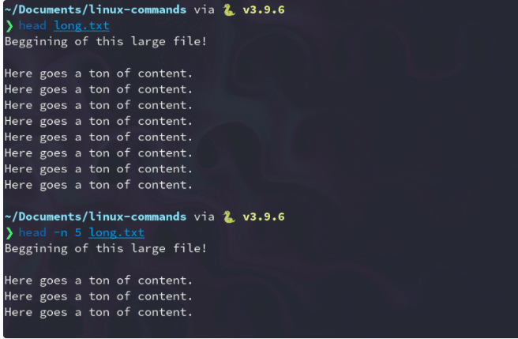
</cite>

# 10. less

<cite style="display:block; text-align: justify">less (opuesto a more) es un programa que permite inspeccionar archivos hacia atrás y hacia adelante: 

* less large_text_file.txt

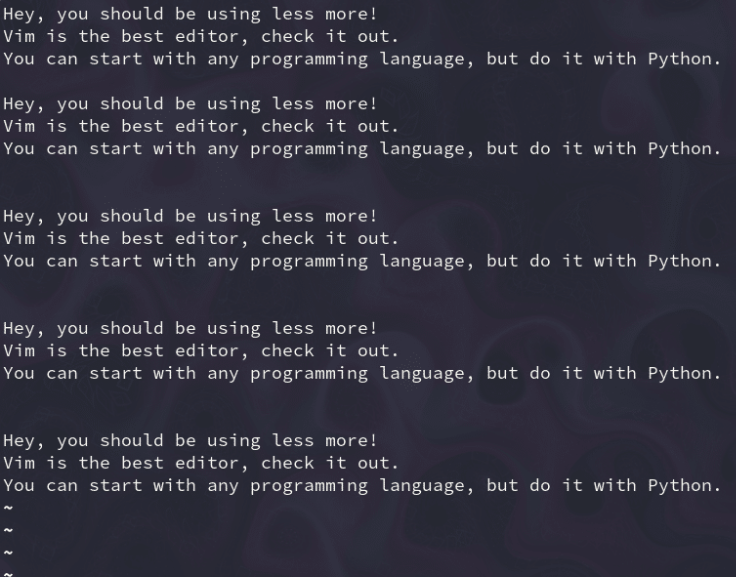
</cite>

# 11. cat

<cite style="display:block; text-align: justify">Cat (de concatenar), es una maravillosa utilidad que nos permite visualizar el contenido de un archivo de texto sin la necesidad de un editor. Para utilizarlo solo debemos mencionarlo junto al archivo que deseamos visualizar:

     $ cat prueba.txt

</cite>

# 12. wc

<cite style="display:block; text-align: justify">Wc significa «word count» (recuento de palabras) y, como su nombre indica, devuelve el número de palabras de un archivo de texto:

     wc long.txt
    # 37 207 1000 long.txt
Vamos a desglosar la salida de este comando:

37 líneas
207 palabras
1000 bytes de tamaño
El nombre del archivo (long.txt)

Si solo necesitas el número de palabras, utiliza el indicador -w:

     wc -w long.txt
     207 long.txt

</cite>

# 13. cut

<cite style="display:block; text-align: justify">El comando de corte se usa en sistemas Linux y Unix para cortar partes y secciones de cada línea de un archivo y escribir el resultado en la salida estándar. Se puede utilizar para cortar partes de una línea por posición de byte, carácter y campo (delimitador).

La sintaxis básica de uso de este comando es la siguiente:

    cut OPCION... [ARCHIVO]...

Dentro de las opciones disponibles para este comando encontramos las siguientes y tú decides cuál usar:

Esta opción enumera y selecciona únicamente los bytes de cada línea en base a los que indiquemos en LIST. LIST puede hacer referencia a un byte, un conjunto de bytes o un rango de bytes

    -b, --bytes=LIST

Esta opción solo selecciona los caracteres de cada línea en base a LIST

    -c, --characters=LIST

Es posible usar el caracter DELIM para usarse como delimitador de campo

    -d, --delimiter=DELIM

Al usar esta opción vamos a seleccionar solo los campos en cada línea o bien podemos imprimir las líneas que no contienen caracteres delimitadores

    -f, --fields=LIST

Es una opción de compatibilidad

    -n

Con esta opción se complementa el conjunto de bytes, caracteres o campos seleccionados

    --complement

No imprime las líneas que no contienen delimitadores
    
    -s, --only-delimited

Es posible usar STRING como la cadena delimitadora de salida de resultados

    --output-delimiter=STRING

Despliega la ayuda del comando cut
    
    --help

Podemos ver la versión del comando cut usada

    --version

Para empezar, podemos visualizar el contenido de un archivo de texto ubicado en el escritorio y con el cual veremos el trabajo del comando cut, este contenido puede ser visualizado usando el comando cat:

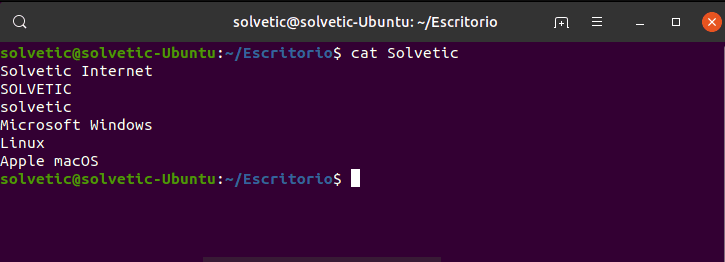

Cada lista en Linux está formada por un entero, un rango de enteros o diversos rangos de enteros los cuales están separados por comas, con cut se pueden usar las siguientes opciones de lectura.

* N el byte, carácter o campo Nth, contados desde 1.
* N- desde el Nth byte, carácter o campo, hasta el final de la línea.
* N-M del Nth al Mth byte, carácter o campo (inclusive).
* -M desde el primer byte al mth byte, carácter o campo
 
Si ejecutamos cut sin un parámetro veremos el siguiente resultado:

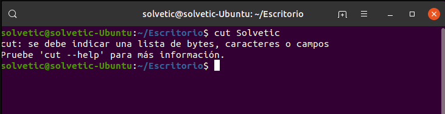

</cite>

# 14. grep

<cite style="display:block; text-align: justify">Grep es una de las utilidades más potentes para trabajar con archivos de texto. Busca líneas que coincidan con una expresión regular y las imprime:

    grep "linux" long.txt
</cite>

# 15. find

<cite style="display:block; text-align: justify">El comando find busca archivos en una jerarquía de directorios basándose en una expresión regex. Para utilizarlo, sigue la siguiente sintaxis:

    find [flags] [path] -name [expression]

Para buscar un archivo llamado long.txt en el directorio actual, introduce lo siguiente

    find ./ -name "long.txt" # ./long.txt 

Para buscar archivos que terminen con una extensión .py (Python), puedes utilizar el siguiente comando:

    find ./ -type f -name "*.py" ./get_keys.py ./github_automation.py ./binarysearch.py

</cite>

# 16. mount

<cite style="display:block; text-align: justify">mount es un comando de sistemas basados en Unix que se utiliza para montar dispositivos y particiones para su uso por el sistema operativo. Montar es hacer que el sistema operativo proyecte el contenido de ese dispositivo o partición en un enlace lógico (un directorio). Cuando se desocupa se rompe el enlace y se sigue trabajando con los mismos archivos básicos.

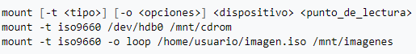

El uso general del comando mount es el siguiente:

    mount -t  (tipo de dispotivo, fat, ext3, ext4, etc )  Directorio de destino (que tiene que estar creado)

</cite>

# 17. umount

<cite style="display:block; text-align: justify">El comando umount le permite eliminar un sistema de archivos remoto que esté montando en la actualidad. El comando umount se puede utilizar con las opciones siguientes:

    –V

Permite realizar pruebas
    
    –a

Desmonta varios sistemas de archivos a la vez. Si se incluyen puntos de montaje con la opción –a, los sistemas de archivos se desmontan. Si no hay puntos de montaje incluidos, se realiza un intento de desmontar todos los sistemas de archivos que aparecen en /etc/mnttab, excepto los sistemas de archivos "necesarios", como /, /usr, /var, /proc, /dev/fd y /tmp. Como el sistema de archivos ya está montado y debe tener una entrada en /etc/mnttab, no tiene que incluir un indicador para el tipo de sistema de archivos.

    –f

Fuerza un sistema de archivos ocupado para que se desmonte. Puede utilizar esta opción para desbloquear un cliente bloqueado cuando intenta montar un sistema de archivos desmontable.

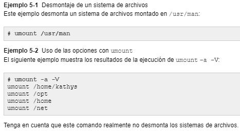
</cite>

# Comandos para la administración de procesos en Linux

# 1. ps

<cite style="display:block; text-align: justify">ps muestra por pantalla un listado de los procesos que se están ejecutando en el sistema.

Si no añadimos ningún parámetro, ps mostrará los procesos del usuario con el que estamos logueados. Por otra parte, los parámetros más básicos a conocer son los siguientes:

    -aux Lista los procesos de todos los usuarios con información añadida (destacamos más abajo).

    -a Lista los procesos de todos los usuarios.

    -u Lista información del proceso como por ejemplo el usuario que lo está corriendo, 
    la utilización de Cpu y memoria, etc.

    -x Lista procesos de todas las terminales y usuarios

    -l Muestra información que incluye el UID y el valor «nice«.

    –forest – Muestra el listado procesos en un formato tipo árbol que permite ver como los procesos interactúan entre sí, podría ser algo similar al comando pstree.

Ejemplo de uso del comando ps:

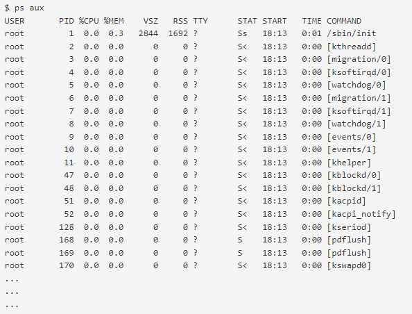
</cite>

# 2. Top

<cite style="display:block; text-align: justify">El comando top es muy útil ya que te puede ayudar a averiguar el estado de tu servidor, proporcionándote información sobre la carga actual, el número de días que lleva encendido sin reiniciarse, el número de usuarios conectados por SSH, y en definitiva información sobre tu servidor en tiempo real.
Este comando se tiene que ejecutar desde SSH, por lo tanto, tendrás que acceder a tu servidor por SSH para poder utilizarlo:

Al usar el comando #top aparecerá lo siguiente

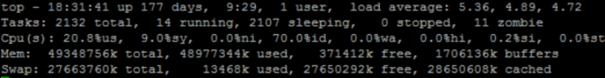

* <b>Línea 1:</b> Proporciona información sobre la hora actual, el tiempo que lleva encendido el servidor, el número de usuarios conectados y la carga del servidor en intervalos de 1, 5 y 15 minutos.

* <b>Línea 2:</b> Muestra el número total de procesos, el número de procesos corriendo, el número de procesos “durmiendo”, el número de procesos parados y el número de procesos “zombie”.

* <b>Línea 3:</b> Proporciona información sobre la carga de CPU.

    * Porcentaje de CPU usada por los procesos de usuarios (20.8%us)
    * Porcentaje de CPU usada para procesos del sistema (9.8%sy)
    * Porcentaje de CPU con prioridad de upgrade nice (0.0%ni)
    * Porcentaje de CPU que actualmente no se está usando (70.0%id)
    * Porcentaje de CPU esperando para las operaciones I/O (0.0%wa)
    * Porcentaje de CPU sirviendo interrupciones de hardware (0.0%hi)
    * Porcentaje de CPU sirviendo interrupciones de software (0.2%si)
    * La cantidad de CPU “robada” de esta máquina virtual por el hypervisor y otras tareas. Este proceso será de 0 en PCs de sobremesa y servidores sin máquinas virtuales (0.0%st)

Líneas 4 y 5: Muestra información sobre el uso de la memoria y el swap.

</cite>

# 3. htop

<cite style="display:block; text-align: justify">Es un visor de procesos para Linux, similar al comando top, pero más visual.

Por ejemplo, permite moverse horizontal y verticalmente, permite una gran multitud de opciones, pero de forma más gráfica.

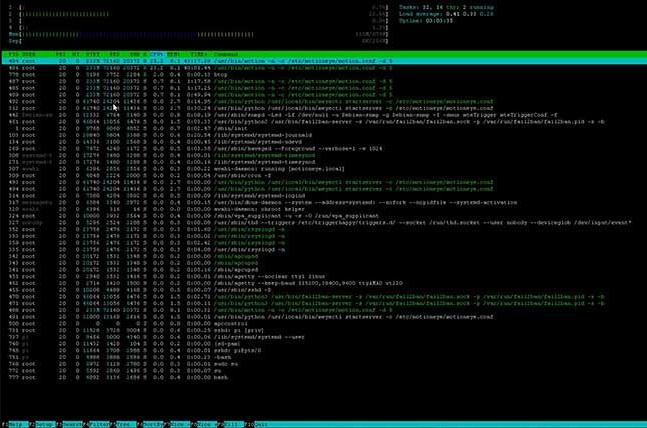

</cite>

# 4. kill
<cite style="display:block; text-align: justify">Kill es un comando utilizado para enviar mensajes sencillos a los procesos ejecutándose en el sistema. Por defecto el mensaje que se envía es la señal de terminación (SIGTERM), que solicita al proceso limpiar su estado y salir. Pero kill no tiene por qué tener que ver con matar al proceso. El comando kill es un wrapper alrededor de la llamada al sistema kill(), que envía señales a procesos o grupos de procesos en el sistema, referenciados por sus IDs de proceso (PIDs) o IDs de grupo de procesos (PGIDs). kill se ofrece siempre como programa independiente, pero la mayoría de las shells tienen intrínsecamente comandos kill que pueden diferir levemente de ella.

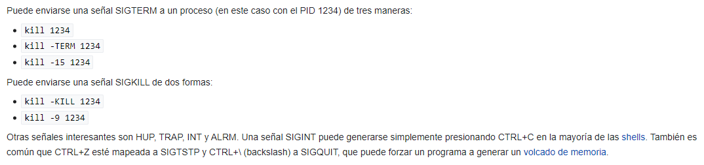
</cite>

# 5. date
<cite style="display:block; text-align: justify">El comando date es un comando existente en sistemas Unix y tipo unix que muestra la hora y la fecha del sistema y el administrador también puede cambiarla.

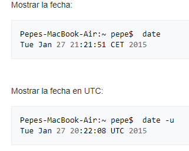
</cite>

# 6. man
<cite style="display:block; text-align: justify">Man es una herramienta de sistemas Unix que se utiliza para documentar y aprender sobre comandos, archivos, llamadas de sistema, etc., en un sistema operativo tal como GNU/Linux.

Actualmente se basa en groff y es el sistema más utilizado para la documentación en sistemas Unix, aunque son pocas las características útiles en comparación con el relativamente reciente comando info, que cuenta con características como enlaces que facilitan la interfaz de usuario, ya que al visitar la documentación relativa a un comando se puede saltar a otra página sin tener que salir y ejecutar nuevamente el programa, que es el caso de man.

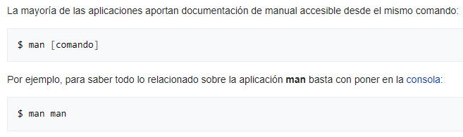
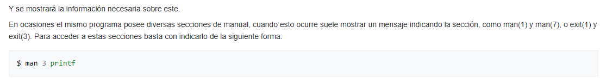
</cite>