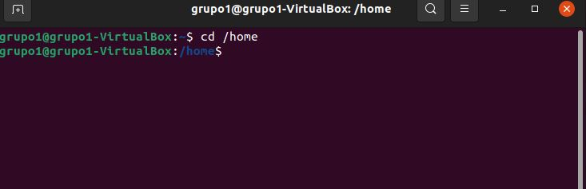
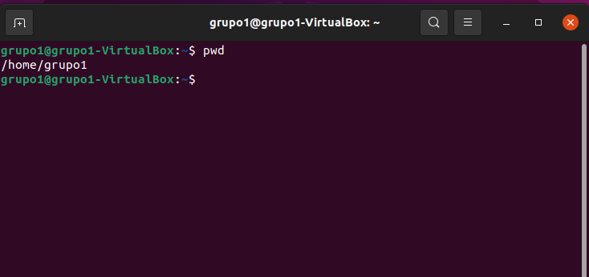
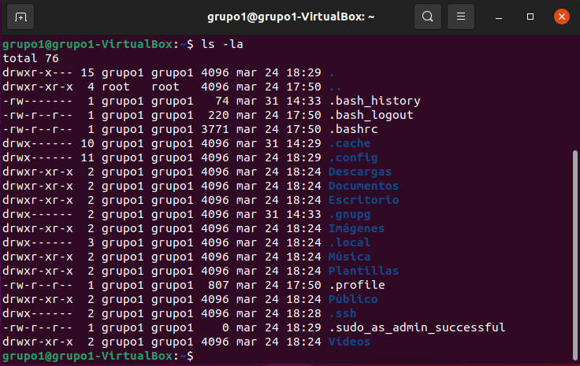

# <b> Comandos más usados en sistemas Linux </b>

<cite style="display:block; text-align: justify">Aunque muchas distribuciones de Linux incorporan modernos y avanzados GUI o interfaces gráficos, el máximo potencial de este sistema operativo se consigue tecleando comandos en la consola.

Es necesario conocer una serie de comandos Linux básicos para poder operar en este sistema operativo de forma más rápida y eficiente.

Desde la consola podemos ejecutar todo tipo de comandos y archivos, desde los más sencillos, a los más avanzados. Eso sí, esta terminal se suele utilizar para ejecutar todo aquello a lo que no tenemos acceso desde la interfaz gráfica del sistema operativo. </cite>

# Comandos para la administración de archivos en Linux

# cd

<cite style="display:block; text-align: justify">Cd (de change directory o cambiar directorio), es como su nombre lo indica el comando que necesitarás para acceder a una ruta distinta de la que te encuentras. 

Por ejemplo, si estas en el directorio /home y deseas acceder a /home/ejercicios, seria:

    $ cd /home/ejercicios

Si estás en /home/ejercicios y deseas subir un nivel (es decir ir al directorio /home), ejecutas:

    $ cd …

</cite>

# pwd

<cite style="display:block; text-align: justify">Pwd (de print working directory o imprimir directorio de trabajo), es un conveniente comando que imprime nuestra ruta o ubicación al momento de ejecutarlo, así evitamos perdernos si estamos trabajando con múltiples directorios y carpetas. Su sintaxis seria:

    $ pwd

</cite>

# ls

<cite style="display:block; text-align: justify">Ls (de listar), permite listar el contenido de un directorio o fichero. La sintaxis es:

    $ ls /home/directorio

El comando ls tiene varias opciones que permiten organizar la salida, lo que resulta particularmente útil cuando es muy grande. Por ejemplo, puedes usar -a para mostrar los archivos ocultos y -l para mostrar los usuarios, permisos y la fecha de los archivos. Así como para todos los comandos Linux, estas opciones pueden combinarse, terminando en algo como:

    $ ls -la /home/directorio

</cite>

# rmdir

<cite style="display:block; text-align: justify">Elimina los directorios sólo si están vacíos. Su sintaxis es la siguiente:

    rmdir [-p][-v][--ignore-fail-on-non-empty][--help][--version] directorio [directorio ...]

Expliquemos un poco las opciones:

* -p: Si el directorio a borrar incluye más de un directorio en el camino, lo borra, luego quita el último componente y borra el directorio resultante, así hasta que todos los componentes hayan sido eliminados. Así, rmdir -p a/b/c es equivalente a rmdir a/b/c; rmdir a/b; rmdir a.

* -v, – -verbose: Muestra un mensaje por cada directorio procesado.

* -ignore-fail-on-non-empty: rmdir no borrará un directorio que no está vacío. Esta opción hace que rmdir ignore el fallo para eliminar el directorio, si ese fallo se debe a que el directorio no está vacío.

* -help: Muestra la ayuda y finaliza.

* -version: Informa de la versión y finaliza.
</cite>