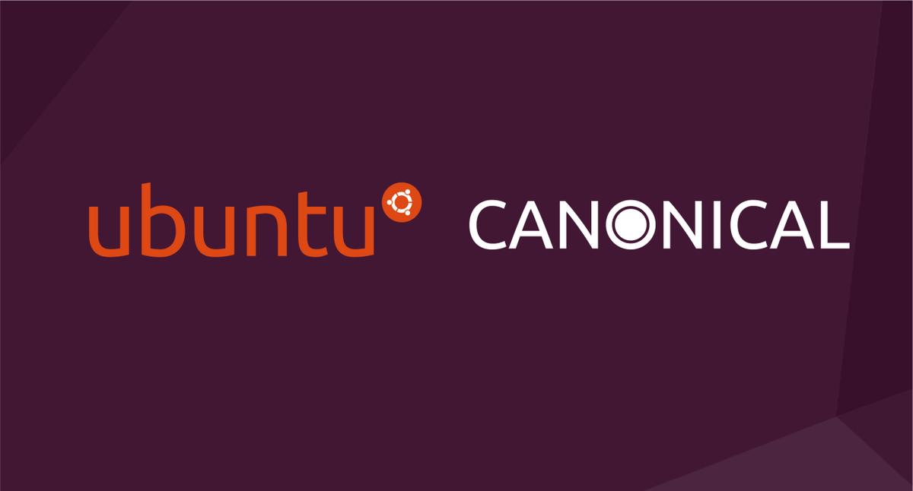
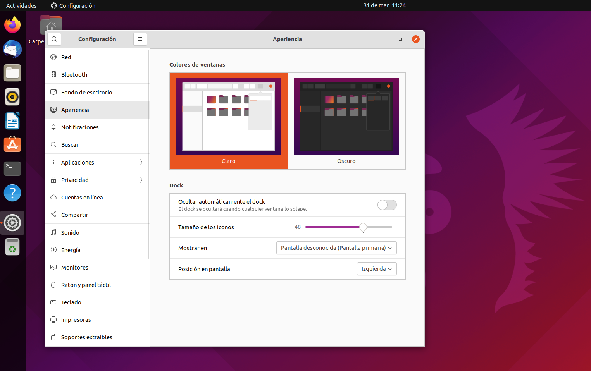
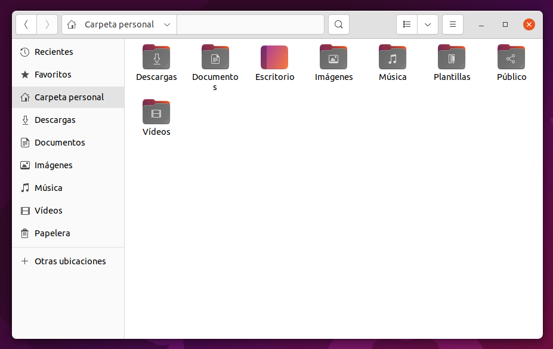

# Realizado Por
1. Paula Andrea Cuellar Moreno
1. Juan Camilo Cruz

## Agenda
1. [VirtualBox][11]
1. [Creación de MV][21]
1. [Ubuntu 21.10][31]

[11]:https://github.com/Paula717/Sistema-Operativo-Ubuntu/tree/main/1-VirtualBox

[21]:https://github.com/Paula717/Sistema-Operativo-Ubuntu/tree/main/2-Creacion%20de%20MV

[31]:https://github.com/Paula717/Sistema-Operativo-Ubuntu/tree/main/3-Ubuntu%2021.10

[1_0]:https://es.wikipedia.org/wiki/Ubuntu

[1_1]:https://es.wikipedia.org/wiki/Distribución_Linux

[1_2]:https://es.wikipedia.org/wiki/Debian_GNU/Linux

[1_3]:https://es.wikipedia.org/wiki/Canonical

[1_4]:https://es.wikipedia.org/wiki/Mark_Shuttleworth

[1_5]:https://www.crehana.com/pe/blog/desarrollo-web/fedora-vs-ubuntu/

# Distribución Ubuntu
<cite style="display:block; text-align: justify">[Ubuntu 21.10][1_0] es una [distribución de GNU/Linux][1_1] basada en [Debian][1_2], que incluye principalmente software libre y de código abierto.

Puede utilizarse en ordenadores y servidores. Está orientado al usuario promedio, con un fuerte enfoque en la facilidad de uso y en mejorar la experiencia del usuario. Está compuesto de múltiple software normalmente distribuido bajo una licencia libre o de código abierto. Estadísticas web sugieren que la cuota de mercado de Ubuntu dentro de las distribuciones Linux es, aproximadamente, del 52 %,3​4​ y con una tendencia a aumentar como servidor web.5​

Su patrocinador, [Canonical][1_3], es una compañía británica propiedad del empresario sudafricano [Mark Shuttleworth][1_4]. 

Ofrece el sistema de manera gratuita, y se financia por medio de servicios vinculados al sistema operativo​ y vendiendo soporte técnico.

Además, al mantenerlo libre y gratuito, la empresa es capaz de aprovechar los desarrolladores de la comunidad para mejorar los componentes de su sistema operativo. Extraoficialmente, la comunidad de desarrolladores proporciona soporte para otras derivaciones de Ubuntu, con otros entornos gráficos, como Kubuntu, Xubuntu, Ubuntu MATE, Edubuntu, Ubuntu Studio, Mythbuntu, Ubuntu GNOME y Lubuntu.

Canonical, además de mantener Ubuntu, provee una versión orientada a servidores, Ubuntu Server, una versión para empresas, Ubuntu Business Desktop Remix, una para televisores, Ubuntu TV, otra versión para tabletas Ubuntu Tablet,también Ubuntu Phone y una para usar el escritorio desde teléfonos inteligentes, Ubuntu for Android.

Cada seis meses se publica una nueva versión de Ubuntu. Esta recibe soporte por parte de Canonical durante nueve meses por medio de actualizaciones de seguridad, parches para bugs críticos y actualizaciones menores de programas. Las versiones LTS (Long Term Support), que se liberan cada dos años,reciben soporte durante cinco años en los sistemas de escritorio y de servidor.</cite>

# Requisitos de instalación de Ubuntu

<cite style="display:block; text-align: justify">listado de requisitos de instalación:

* Espacio en disco: 2.5 GB
* Memoria RAM: 512 MB (aunque es recomendable 1GB como mínimo)
* Procesador: 1 GHz o superior
* Resolución:  9″ con resolución HD (720p) o superior
* Duración de la instalación: 15 minutos aprox.</cite>

# Ventajas de Ubuntu

<cite style="display:block; text-align: justify">

1. <b><u>Es libre y gratuito:</u></b> Cuando hablamos de qué es Ubuntu, y cuáles son sus ventajas y desventajas es importante recordar que no tiene ningún costo, tanto su instalación como sus actualizaciones son completamente gratis y, en cualquiera de sus versiones, no necesita licencia.

1. <b><u>Es seguro y confiable:</u></b> Comparado con otros sistemas operativos, una de las mayores ventajas de Ubuntu es la seguridad. Una de las características de Linux y sus sistemas en general es que son menos proclives a recibir ataques de parte de los hackers. Además, en la comparación de ventajas y desventajas de Ubuntu encontramos que es un sistema operativo estable que recibe actualizaciones de seguridad automáticas de manera frecuente, lo que implica que no es necesario instalar un antivirus para su protección.

1. <b><u>Es veloz y consume menos recursos:</u></b> Este sistema operativo tiene muchas virtudes y una de ellas es que es liviano y fácil de usar. Una vez instalado, el programa no es para nada pesado y funciona rápido, aprovechando los recursos de manera inteligente y administrando las tareas de forma eficaz.
Además, dentro de las ventajas y desventajas del sistema operativo Ubuntu, la ventaja principal es que la interfaz de Ubuntu es tan rápida que a tu computadora sólo le llevará menos de nueve segundos apagarse, además del rápido funcionamiento en todos sus programas y en la velocidad del cursor.

1. <b><u>Es personalizable:</u></b> Para muchas personas que disfrutan de darle su toque personal a su espacio de trabajo, una de las principales ventajas de usar Ubuntu es que se trata de un sistema operativo completamente personalizable. 
Gracias a su funcionalidad de código abierto y con un poco de conocimientos de programación, puedes modificar las herramientas que ofrece este sistema, así como crear nuevas aplicaciones y retocar la interfaz que tiene por defecto. Además, si hablamos de diseño, podrás modificar todos y cada uno de los íconos del inicio ¡y darle tu toque personal!

1. <b><u>Incluye herramientas gratuitas:</u></b> Entre las ventajas de Ubuntu, podemos encontrar que este sistema cuenta con aplicaciones y herramientas gratuitas que pueden ser de gran valor para los usuarios. Desde una simple calculadora hasta un programa de gráficos por computadora, las herramientas que ofrece Ubuntu son completamente gratuitas y funcionales.

1. <b><u>Es versátil y accesible:</u></b> Este sistema operativo es bastante popular debido a su simpleza y accesibilidad, puesto que, además de estar disponible en varios idiomas, una de las ventajas de Ubuntu es que es fácil de entender y sus sistema de software se lleva bien con otros sistemas, como el de Windows.

1. <b><u>Se actualiza constantemente:</u></b> Las constantes actualizaciones y la presentación de nuevas versiones son unas de las ventajas de Ubuntu que debes tener en cuenta si quieres usar un sistema operativo que se encuentre siempre a la vanguardia y que mejore constantemente.

1. <b><u>Su sistema de organización es muy eficaz:</u></b> una de las características favoritas de los usuarios más avanzados es que este sistema operativo tiene una estructura que permite organizar de mejor manera todo el software y priorizar las funciones de este, haciéndolo mucho más eficaz que otros.
De forma predeterminada, Ubuntu divide el software en cuatro secciones conocidas como “componentes”, para mostrar diferencias en licencias y la prioridad con la que se atienden los problemas que informen los usuarios.​ Estos componentes son cuatro: main, restricted, universe y multiverse.

   De acuerdo con la información proporcionada por la página Guía Ubuntu, podemos entender estos componentes de la siguiente forma:

* <b>main:</b> Contiene solamente los paquetes que cumplen los requisitos de la licencia de Ubuntu, y para los que hay soporte disponible por parte de su equipo. Está pensado para que incluya todo lo necesario para la mayoría de los sistemas Linux de uso general. Los paquetes de este componente poseen ayuda técnica garantizada y mejoras de seguridad oportunas.

* <b>restricted:</b> Contiene paquetes soportados por los desarrolladores de Ubuntu debido a su importancia, pero que no está disponible bajo ningún tipo de licencia libre para incluir en main. En este lugar se incluyen los paquetes tales como los controladores propietarios de algunas tarjetas gráficas, como los de ATI y NVIDIA. El nivel de la ayuda es más limitado que para main, puesto que los desarrolladores pueden no tener acceso al código fuente.

* <b>universe:</b> Contiene una amplia gama de programas, que pueden o no tener una licencia restringida, pero que no recibe apoyo por parte del equipo de Ubuntu sino por parte de la comunidad. Esto permite que los usuarios instalen toda clase de programas en el sistema guardándolos en un lugar aparte de los paquetes soportados: main y restricted.

* <b>multiverse:</b> Contiene los paquetes sin soporte debido a que no cumplen los requisitos de software libre.
</cite>

# Desventajas de Ubuntu

<cite style="display:block; text-align: justify">

1. <b><u>Gráficos de bajo rendimiento:</u></b> Aunque Ubuntu es uno de los mejores sistemas operativos y aunque con él puedes realizar una infinidad de tareas impresionantes, lo cierto es que no es capaz de soportar la calidad de gráficos requerida para un videojuego de gama alta. 

    Muchos de los videojuegos tienen alta calidad en sus imágenes y sus animaciones, porque es una de las partes fuertes del mundo gamer. Los colores, las dimensiones, los gráficos y las animaciones son esenciales. Lamentablemente, si de ventajas y desventajas de Ubuntu hablamos, definitivamente la incapacidad que tiene este sistema para ejecutar muchos de los videojuegos más populares hoy en día, estaría dentro del segundo grupo.
 
    En Ubuntu las animaciones serán lentas, además de que los gráficos de la mayoría de los videojuegos no van a poder mostrarse, lo que te limitará a tener pocos videojuegos y, si eres alguien que disfruta de estar siempre al tanto de las novedades del mundo gamer, no te servirá para nada. 

1. <b><u>Fuera del estándar empresarial:</u></b> Como suele ocurrir muchas veces con el software libre, una de las desventajas de Ubuntu es que no es un sistema operativo tan popular como los que son más comerciales debido a que no tiene una fuerte presencia de marca generada por anuncios y campañas de marketing que lo publiciten.

   Debido a esto, en muchos de los casos, Ubuntu no es el sistema operativo que eligen las empresas, por lo que puedes tener problemas de compatibilidad o de adaptación si tu sueles trabajar con este sistema en lugar de uno de los más reconocidos, como Windows.

1. <b><u>Requiere de conocimientos de programación:</u></b> Aunque no es necesario que poseas grandes conocimientos, si quieres sacarle todo el provecho a Ubuntu, sí que deberías conocer al menos lo básico de los lenguajes de programación, como las etiquetas HTML y propiedades CSS, y, preferentemente, tener conocimientos sólidos en este tema, para así ser capaz de manipular el sistema operativo con mayor control y acceder a las funciones más avanzadas.

   En cuanto a tu experiencia, si no tienes una comprensión avanzada en Linux entonces te convendrá mantener tu sistema operativo actual ya que entre las ventajas y desventajas de utilizar Ubuntu, una de las desventajas es el nivel avanzado del sistema operativo en cuanto a su uso, a lo que te será más difícil adaptarte si eres novato o no tienes nada de experiencia.

1. <b><u>No es compatible con todo el software:</u></b> Lo que no tiene Ubuntu es compatibilidad con algunos tipos de software, característica que lo aparta de tener un alcance mayor. Entre las ventajas y desventajas de Ubuntu con respecto a Windows se reconoce que es imposible que este sistema ejecute muchas de las aplicaciones disponibles en otras plataformas, por lo que es una gran desventaja que no se puede dejar de lado si estás pensando en instalar Ubuntu.

   Sin embargo, tal como lo mencionamos en las ventajas de Ubuntu, este es un sistema que se actualiza de forma constante y, con cada una de sus actualizaciones, la compatibilidad con otros programas y con otros sistemas operativos cada vez tiene mayor alcance.

1. <b><u>No es el sistema operativo más innovador:</u></b> Una de las desventajas de Ubuntu más evidentes para los usuarios al recién instalarlo, es que este sistema no es uno de los más innovadores en cuanto a su aspecto, su interfaz y otras funcionalidades que los sistemas operativos más vanguardistas sí que han trabajado a lo largo de los años. Incluso, en el duelo de [Fedora vs Ubuntu][1_5], encontramos que esta otra distribución de Linux es mucho más actual y vanguardista.

   No obstante, no debemos olvidar que dentro de los foros de Ubuntu, la comunidad de usuarios siempre comparte trucos e información relevante que puede ayudar a que incluso los usuarios con menos experiencia sean capaces de modificar o agregar funciones que les parezcan interesantes y así mantener fresco el entusiasmo por este sistema.
</cite>

[1_6]:https://www.genbeta.com/linux/esta-disponible-gnome-40-probablemente-mayores-actualizaciones-gnome-3-mejores

# Entorno de escritotio de Ubuntu 21.10 

<cite style="display:block; text-align: justify">Ubuntu 21.10 incluye muchas innovaciones, principalmente el entorno de escritorio [GNOME 40][1_6] junto con la biblioteca GTK4. Los escritorios virtuales en el modo Vista general tienen ahora una orientación horizontal más clara. GNOME actualizado también significa una serie de mejoras en Wayland; especialmente porque ahora es compatible con el último controlador propietario de NVIDIA.

Para admitir el nuevo hardware, el sistema se migró al kernel de Linux 5.13. Puede que esto no sea tan bueno como Linux 5.14, pero es un gran paso adelante de 5.11 en Ubuntu 21.04. En el nuevo SO se realizó la transición al algoritmo Zstd para comprimir paquetes Debian, por lo que su instalación es casi dos veces más rápida. Al mismo tiempo, el navegador predeterminado Mozilla Firefox ahora se suministra en un paquete Snap, lo que permitirá que se actualice más rápidamente, ya que es compatible con los desarrolladores del navegador. 

Las novedades con GNOME 40 incluyen desde el nuevo diseño de la vista de actividades y nuevo lanzador de aplicaciones. Además, con la nueva versión de GNOME también se mejora el soporte multimonitor.

Tras instalar Ubuntu 19.10 he tenido la experiencia de gaming en Linux más simple y completa de mi vida
EN GENBETA
Tras instalar Ubuntu 19.10 he tenido la experiencia de gaming en Linux más simple y completa de mi vida
Tenemos nuevos gestos para el touchpad y nuevas acciones para el ratón. Ahora las áreas de trabajo se organizan de forma horizontal y a la lista de aplicaciones se accede de forma vertical. A diferencia del GNOME 40 vainilla, en Ubuntu se ha modificado para que el dock de aplicaciones siga apareciendo a la izquierda y las áreas de trabajo sigan arriba en lugar de abajo. </cite>

# Explorador de archivos de Ubuntu 21.10 

<cite style="display:block; text-align: justify">El gestor de archivos proporciona una interfaz de usuario para administrar archivos y directorios. Las operaciones más comunes realizadas en archivos o grupos de archivos incluyen crear, abrir, ver, reproducir, editar o imprimir, cambiar nombre, copiar, mover, eliminar y buscar archivos; así como modificar sus atributos, propiedades y permisos de acceso.

* <b>Nautilus</b> 

  Este gestor es el que se encuentra por defecto en el entorno de escritorio de GNOME, Nautius cuenta con una interfaz intuitiva, este gestor puede ser complementado mediante plugins adicionales.</cite>

[1_7]:https://ubuntu.com/about/packages

[1_8]:https://wiki.ubuntu.com/AppArmor?_ga=2.1583737.992084208.1648746099-887765086.1648746099

# [Paquetes de Ubuntu 21.10][1_7]

<cite style="display:block; text-align: justify">El software para Ubuntu se entrega utilizando una gama de tecnologías de empaquetado, cada una de las cuales es óptima para escenarios específicos.</cite>

# 1. Los paquetes 'Deb' son el corazón de Ubuntu 

<cite style="display:block; text-align: justify">El formato de paquete 'deb' proviene de la distribución Debian Linux y es ampliamente considerado el mejor formato de paquete para bibliotecas y aplicaciones de nivel de sistema con dependencias ricas y dinámicas. Usamos paquetes .deb para crear el sistema operativo base Ubuntu e incluimos decenas de miles de debs para una amplia gama de aplicaciones de código abierto.

Los paquetes deb se instalan sin confinamiento, lo que significa que un paquete deb tiene control total de su sistema cuando se instala, y solo debe instalar paquetes deb en los que confíe completamente en la seguridad de su sistema. Tenga mucho cuidado cuando se le pida que agregue paquetes deb de terceros manualmente, o archivos adicionales o repositorios de paquetes deb, porque tendrán un control efectivo de su máquina. Le recomendamos que rechace la instalación de debs de terceros a menos que tenga razones muy específicas para hacerlo.

El software empaquetado de Deb puede incluir perfiles de [AppArmor][1_8] que limitan su alcance, lo que es beneficioso para la seguridad general del sistema, pero no restringe ni limita los scripts que manejan la instalación y las actualizaciones o la eliminación de paquetes. Debs no se puede usar en Ubuntu Core orientado a dispositivos.

Los paquetes estándar de Ubuntu se basan en una infraestructura confiable de código abierto. Si bien no se puede garantizar que sean seguros, la procedencia del código y el sistema de compilación garantizan que se puedan auditar y se sepa que funcionan de una manera particular.

Las actualizaciones de debs no se gestionan; una actualización problemática puede dejar archivos en su disco que causen problemas más adelante. Cuando se desempaquetan los deb en su sistema, ya no es posible validarlos de manera precisa y eficiente, lo que significa que los compromisos y las intrusiones en un sistema basado en deb son más difíciles de identificar.</cite>

# 2. Los paquetes 'Snap' tienen mejor seguridad y actualizaciones 

<cite style="display:block; text-align: justify">Se prefieren los paquetes 'snap' más nuevos para componentes independientes, especialmente aplicaciones. Pueden estar rigurosamente confinados , lo que significa que cada etapa de la instalación y operación de la aplicación puede mantenerse segura. Un complemento 'estrictamente' confinado tiene un conjunto muy específico de funciones que puede usar, lo que requiere una supervisión adecuada por parte de Canonical, y si ese software se ve comprometido, esas medidas de seguridad deberían limitar el impacto de la vulnerabilidad.

También hay instantáneas 'clásicas', que no están confinadas y que, por lo tanto, son equivalentes a debs de terceros. Recomendamos encarecidamente que establezca la buena fe de cualquier editor de complementos clásico de terceros. Las instantáneas clásicas importantes o ampliamente utilizadas deben tener editores "verificados" en la tienda.

Es menos probable que las instantáneas tengan problemas con las dependencias a lo largo de su vida porque agrupan estas dependencias o usan dependencias estándar proporcionadas por el sistema de una manera estandarizada. Sin embargo, depende del editor del complemento asegurarse de que los problemas de dependencias se resuelvan con las versiones más recientes del complemento, ya que el proveedor original del software crea y publica los complementos directamente. Eso también significa que las arquitecturas admitidas por un complemento están determinadas por el proveedor, no por Canonical, y la seguridad del sistema de compilación a menudo también depende del proveedor. Algunas instantáneas se basan en una infraestructura confiable para todas las arquitecturas. Puede pedirle a su proveedor que siga ese enfoque para las instantáneas donde esto sea importante para usted.

El mecanismo de actualización para instantáneas es altamente confiable, con copias de seguridad automáticas de datos relevantes y la capacidad de revertir a la versión anterior de la actualización falla.

Las instantáneas siempre se almacenan en un formato que admite la validación de firmas, lo que significa que las intrusiones son más fáciles de detectar.</cite>

# 3. Los charms son paquetes para operaciones de software en la nube

<cite style="display:block; text-align: justify">En el mundo de la nube, es útil compartir el código de operaciones de software tanto como lo es compartir el código de las propias aplicaciones. En lugar de tener muchas organizaciones diferentes codificando operaciones por separado, Ubuntu permite la colaboración de operaciones basadas en la comunidad con un paquete estándar de "encanto" para operaciones.

Los accesos manejan el ciclo de vida de la aplicación: implementación, integración y configuración, actualizaciones y desmontaje.

Hay encantos tanto para las operaciones en la nube basadas en máquinas virtuales como para las operaciones en la nube basadas en Kubernetes. Los accesos pueden usar una variedad de sistemas operativos, pero la mayoría de los accesos están basados ​​en Ubuntu, por lo que se benefician de la seguridad estándar y la familiaridad del resto de Ubuntu.</cite>

