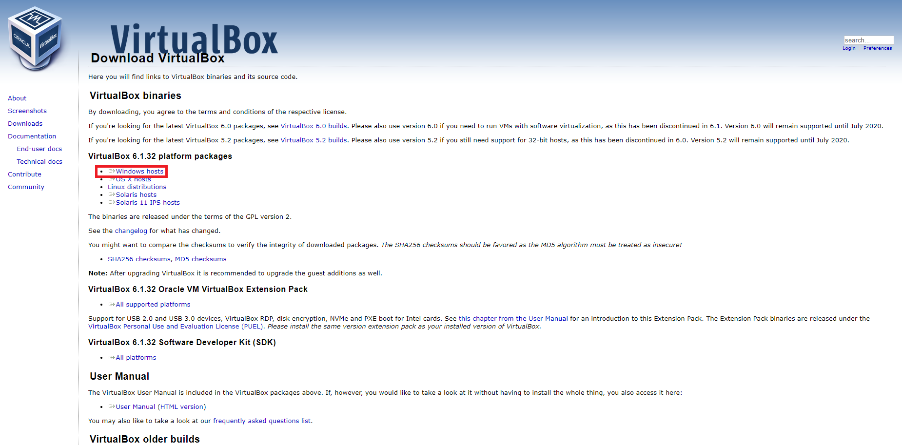

# VirtualBox

<cite style="display:block; text-align: justify">VirtualBox es una aplicación que sirve para hacer máquinas virtuales con instalaciones de sistemas operativos. Esto quiere decir que si tienes un ordenador con Windows, GNU/Linux o incluso macOS, puedes crear una máquina virtual con cualquier otro sistema operativo para utilizarlo dentro del que estés usando.</cite>

 

# Descarga e instalación del VirtualBox
<cite style="display:block; text-align: justify">Lo primero que haremos es ir a la página oficial de [VirtualBox][1_0] y descargar el instalador, en esta pagina nos vamos a ubicar en la parte de paquetes de plataforma de VirtualBox, en esta momento se encuentra en la versión 6.1.32]; en esta pagina se encuentran los instaladores para los SO de Windows, OS X, Linux y Solaris    </cite>

[1_0]:https://www.virtualbox.org/wiki/Downloads