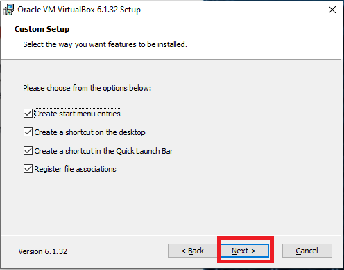
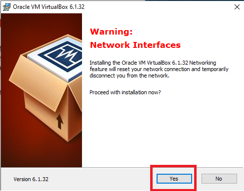

# <b> VirtualBox </b>

<cite style="display:block; text-align: justify">VirtualBox es una aplicación que sirve para hacer máquinas virtuales con instalaciones de sistemas operativos. Esto quiere decir que si tienes un ordenador con Windows, GNU/Linux o incluso macOS, puedes crear una máquina virtual con cualquier otro sistema operativo para utilizarlo dentro del que estés usando.</cite>

 

# <b> Descarga e instalación del VirtualBox </b>
<cite style="display:block; text-align: justify">Lo primero que haremos es ir a la página oficial de [VirtualBox][1_0] y descargar el instalador, en esta pagina nos vamos a ubicar en la parte de paquetes de plataforma de VirtualBox, en este momento se encuentra en la versión 6.1.32; en esta pagina se encuentran los instaladores para los SO de Windows, OS X, Linux y Solaris, en este caso nosotros descargaremos el instalador de Windows.</cite>

[1_0]:https://www.virtualbox.org/wiki/Downloads

<cite style="display:block; text-align: justify">Una vez que termine la descarga, le damos clic derecho al instalador y lo ejecutamos como administrador, si pide permiso le damos en si.</cite>

<cite style="display:block; text-align: justify">Le damos en siguiente</cite>

<cite style="display:block; text-align: justify">En esta ventana nos aparece los siguiente</cite>

<cite style="display:block; text-align: justify"><b><u>* Soporte de USB del VirtualBox:</b></u> El cual va a instalar un controlador USB especial para el VirtualBox, esto nos ayudara para poder conectar USB o algún otro tipo de almacenamiento en nuestra máquina virtual.</cite>

<cite style="display:block; text-align: justify"><b><u>* En redes del VirtualBox:</b></u> Se instalará un controlador de red especial para el VirtualBox, esto nos ayudará para poder acceder a una red cableada o a una red inalámbrica.</cite>

<cite style="display:block; text-align: justify"><b><u>* El puente de red de VirtualBox:</b></u> Este va a instalar un controlador para poder realizar un puente especial para el VirtualBox, esto va a ayudar para que nuestra maquina virtual pueda interconectarse con otra computadora, de esta manera podemos realizar transferencia de datos de una red hacia otra.</cite>

<cite style="display:block; text-align: justify"><b><u>* La red del host del VirtualBox:</b></u> Este instalara un controlador y adaptador de red virtual y nos ayudara para que nuestra maquina virtual acceda al host del anfitrión.</cite>

<cite style="display:block; text-align: justify"><b><u>* El soporte de Python:</b></u> Este instalara un script para el VirtualBox.</cite>

<cite style="display:block; text-align: justify">Una vez ya tengamos claro las características que vamos a instalar le daremos en siguiente.
</cite>

<cite style="display:block; text-align: justify">Dejamos todo como esta y le damos en Siguiente.
</cite>

<cite style="display:block; text-align: justify">En esta ventana nos muestra esta advertencia sobre las interfaces de red, lo cual nos dice que la instalación de la función de red de Oracle VirtualBox 6.1.32 va a restablecer su conexión de red y lo desconectara temporalmente de la red, teniendo en cuenta esto le damos en siguiente.
</cite>

